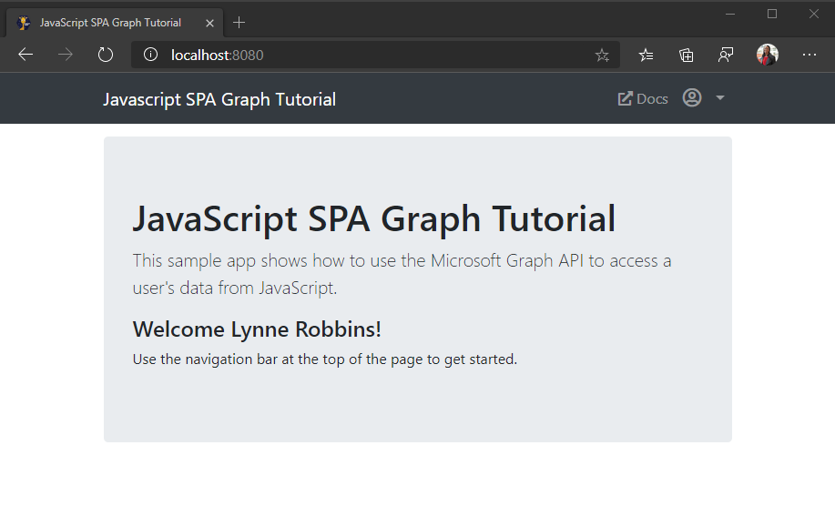

<!-- markdownlint-disable MD002 MD041 -->

Dans cet exercice, vous allez étendre l’application de l’exercice précédent pour prendre en charge l’authentification avec Azure AD. Cela est nécessaire pour obtenir le jeton d’accès OAuth nécessaire pour appeler Microsoft Graph. Dans cette étape, vous allez intégrer la bibliothèque de la [bibliothèque d’authentification Microsoft](https://github.com/AzureAD/microsoft-authentication-library-for-js) dans l’application.

1. Créez un fichier dans le répertoire racine nommé **config.js** et ajoutez le code suivant.

    :::code language="javascript" source="../demo/graph-tutorial/config.example.js" id="msalConfigSnippet":::

    Remplacez `YOUR_APP_ID_HERE` par l’ID de l’application dans le portail d’inscription des applications.

    > [!IMPORTANT]
    > Si vous utilisez le contrôle de code source tel que git, il est maintenant recommandé d’exclure le **config.js** fichier du contrôle de code source afin d’éviter une fuite accidentelle de votre ID d’application.

1. Ouvrez **auth.js** et ajoutez le code suivant au début du fichier.

    :::code language="javascript" source="../demo/graph-tutorial/auth.js" id="authInitSnippet":::

## <a name="implement-sign-in"></a>Implémentation de la connexion

Dans cette section, vous allez implémenter les `signIn` `signOut` fonctions et.

1. Remplacez la fonction `signIn` existante par ce qui suit.

    ```javascript
    async function signIn() {
      // Login
      try {
        // Use MSAL to login
        const authResult = await msalClient.loginPopup(msalRequest);
        console.log('id_token acquired at: ' + new Date().toString());
        // Save the account username, needed for token acquisition
        sessionStorage.setItem('msalAccount', authResult.account.username);
        // TEMPORARY
        updatePage(Views.error, {
          message: 'Login successful',
          debug: `Token: ${authResult.accessToken}`
        });
      } catch (error) {
        console.log(error);
        updatePage(Views.error, {
          message: 'Error logging in',
          debug: error
        });
      }
    }
    ```

    Ce code temporaire affiche le jeton d’accès après une connexion réussie.

1. Remplacez la fonction `signOut` existante par ce qui suit.

    :::code language="javascript" source="../demo/graph-tutorial/auth.js" id="signOutSnippet":::

1. Enregistrez vos modifications et actualisez la page. Une fois connecté, un message d’erreur s’affiche pour afficher le jeton d’accès.

## <a name="get-the-users-profile"></a>Obtenir le profil de l’utilisateur

Dans cette section, vous allez améliorer la `signIn` fonction permettant d’utiliser le jeton d’accès pour obtenir le profil de l’utilisateur à partir de Microsoft Graph.

1. Ajoutez la fonction suivante dans **auth.js** pour récupérer le jeton d’accès de l’utilisateur.

    :::code language="javascript" source="../demo/graph-tutorial/auth.js" id="getTokenSnippet":::

1. Créez un fichier à la racine du projet nommé **graph.js** et ajoutez le code suivant.

    :::code language="javascript" source="../demo/graph-tutorial/graph.js" id="graphInitSnippet":::

    Ce code crée un fournisseur d’autorisation qui encapsule la `getToken` méthode dans **auth.js** et initialise le client Graph avec ce fournisseur.

1. Ajoutez la fonction suivante dans **graph.js** pour obtenir le profil de l’utilisateur.

    :::code language="javascript" source="../demo/graph-tutorial/graph.js" id="getUserSnippet":::

1. Remplacez la fonction `signIn` existante par ce qui suit.

    :::code language="javascript" source="../demo/graph-tutorial/auth.js" id="signInSnippet":::

1. Enregistrez vos modifications et actualisez la page. Une fois que vous êtes connecté, vous devez revenir sur la page d’accueil, mais l’interface utilisateur doit changer pour indiquer que vous êtes connecté.

    

1. Cliquez sur Avatar de l’utilisateur dans le coin supérieur droit pour accéder au lien **déconnexion** . Cliquez sur **déconnexion** pour réinitialiser la session et revenir à la page d’accueil.

    

## <a name="storing-and-refreshing-tokens"></a>Stockage et actualisation des jetons

À ce stade, votre application a un jeton d’accès, qui est envoyé dans l' `Authorization` en-tête des appels d’API. Il s’agit du jeton qui permet à l’application d’accéder à Microsoft Graph pour le compte de l’utilisateur.

Cependant, ce jeton est de courte durée. Le jeton expire une heure après son émission. C’est là que le jeton d’actualisation devient utile. Le jeton d’actualisation permet à l’application de demander un nouveau jeton d’accès sans obliger l’utilisateur à se reconnecter.

Étant donné que l’application utilise la bibliothèque MSAL, vous n’avez pas besoin d’implémenter de logique d’actualisation ou de stockage de jetons. MSAL met en cache le jeton dans la session de navigateur. La `acquireTokenSilent` méthode vérifie d’abord le jeton mis en cache et, s’il n’a pas expiré, il le renvoie. Si elle a expiré, elle utilise le jeton d’actualisation mis en cache pour en obtenir une nouvelle. L’objet client Graph appelle la `getToken` méthode dans **auth.js** à chaque demande, en s’assurant qu’il dispose d’un jeton à jour.
